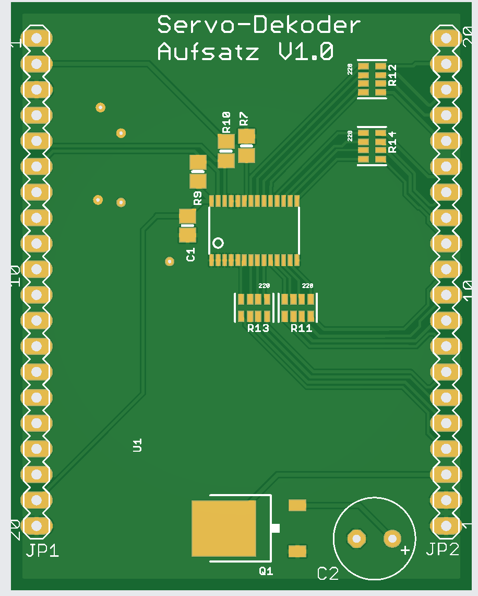
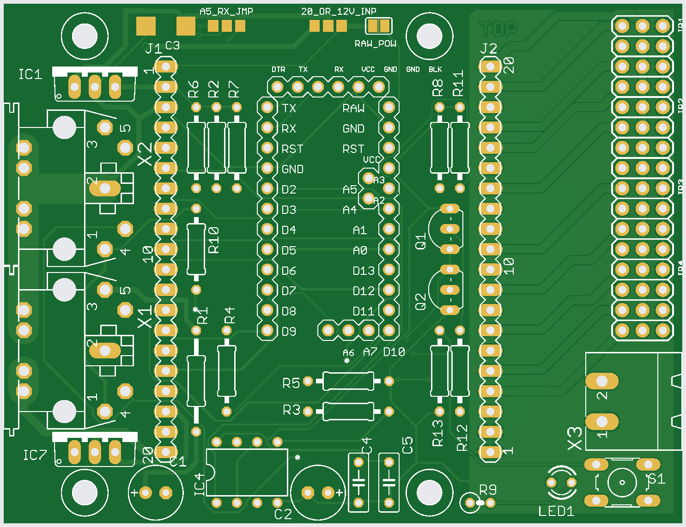

# Servodekoder – kurze Beschreibung

Dieses Projekt kombiniert eine OpenSX-Basisplatine mit einem Servo-Aufsatz (PCA9685), um bis zu 16 Servokanäle anzusteuern.

- Basisplatine: `SXV0300_Servo`
- Aufsatz: `Servo` (PCA9685)
- Testsoftware: `software/ServoTest/ServoTest.ino`

Wichtig: Der Jumper `A5_RX` auf der Basisplatine muss auf **A5** stehen, damit I2C-SCL korrekt verbunden ist.

## Bild Aufsatz

## Bild Basisplatine

## Bildquellen
- Aufsatzbild (lokale Quelle): `/home/michael/Bilder/ServoAufsatz.png`
- Basisplatinenbild (lokale Quelle): `/home/michael/Bilder/BasisPlatine Servo.png`
